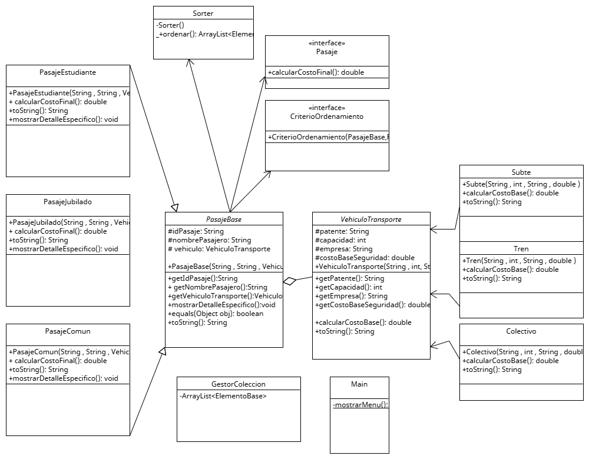

# 2026-UTN-P2-Q1-325-R1-German_Ariel_Stadelman
Repositorio dedicado a primer cuatri Programacion 2 DIV 325
# 💻 Examen Parcial I | Programación II

Repositorio oficial para la entrega del **Primer Parcial** de la cursada de Programación II (Tecnicatura Universitaria en Programación - UTN FRA).

---

### 🎓 Información Académica


| Campo | Detalle |
| :--- | :--- |
| **Estudiante** | German Ariel Stadelman |
| **Institución** | Universidad Tecnológica Nacional - Facultad Regional Avellaneda (UTN-FRA) |
| **Materia** | Programación II (P2) |
| **División** | 325 |
| **Ciclo Lectivo** | 2026 - Cuatrimestre 1 |
| **Fecha de Examen** | Viernes 22 de mayo - 18:30hs |

---

### 🛠️ Stack Tecnológico
*   **Lenguaje:** `Java 25 (LTS)`
*   **Entorno de Desarrollo:** `Apache NetBeans`
*   **Gestión de Dependencias:** `Ant`

---

### 📊 Modelado (UML)
El diseño de la solución está basado en el siguiente diagrama de clases, realizado con **UML Lettino**:

 

---

### 🚀 Guía de Ejecución

Para correr este proyecto localmente, seguí estos pasos:

#### 1. Requisitos Previos
Asegurate de tener instalado el **JDK 25** y que la variable de entorno `JAVA_HOME` apunte a esa versión.

#### 2. Clonado del Proyecto
```bash
git clone https://github.com/theyermans/2026-UTN-P2-Q1-325-R1-German_Ariel_Stadelman
```

#### 3. Apertura en NetBeans
1. Abrí **Apache NetBeans**.
2. Andá al menú `File` > `Open Project...`.
3. Buscá la carpeta clonada y seleccioná el proyecto (identificado con el icono de la taza de café).
4. Dale clic a **Open Project**.

#### 4. Compilación y Ejecución
*   **Limpiar y Construir:** Presioná el icono del martillo y la escoba (`Clean and Build`) para que Ant prepare todo.
*   **Ejecutar:** Presioná `F6` o hacé clic derecho en el proyecto y seleccioná **Run**.

---

### 📂 Estructura del Repositorio
*   `/src`: Código fuente organizado por paquetes.
*   `/nbproject`: Archivos de configuración de NetBeans.
*   `build.xml`: Script de automatización de Ant.
*   `diagrama_uml.png`: Imagen del modelado de clases.
*   `README.md`: Documentación del proyecto.

---
